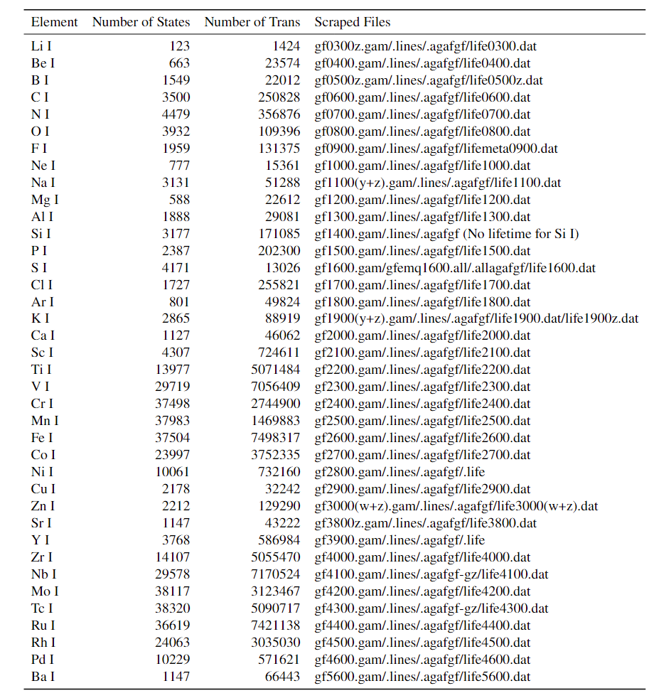
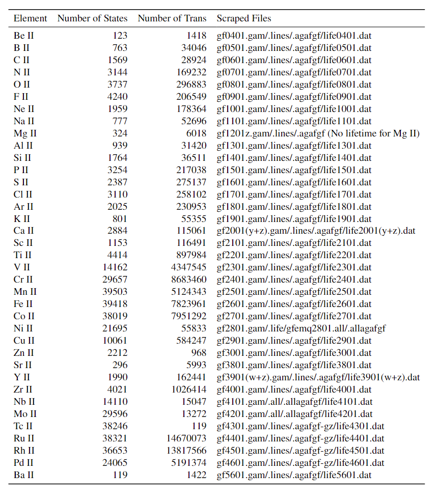

# Kurucz-Atoms

## PyExoCross validation

A modular high-ionization validation pipeline is available under
`validation/`. It performs independent `.states`/`.trans`/`.pf` preflight
checks, charge-aware metadata validation, PyExoCross partition functions and
lifetimes, LTE stick spectra, optional exploratory cross-sections, plots, CSVs,
and per-ion reports.

See [docs/PYEXOCROSS_VALIDATION.md](docs/PYEXOCROSS_VALIDATION.md) for the
verified Sc III command, batch usage, schemas, units, tolerances, interpretation,
and scientific limitations.

This repository holds the Kurucz Atomic database files, which are reformatted into Exomol's .states and .trans files.

Due to the size Limitation, the files cannot be uploaded directly to the GitHub page. Therefore, the data are uploaded to Zenodo and the link will be provided here.

Zenodo (neutral and singly ionized species, earlier release):
https://doi.org/10.5281/zenodo.12819622

Zenodo (ionization stages III-X, this work):
https://doi.org/10.5281/zenodo.21907103

The data folder is formatted as: Kurucz/(Atom-name)(_p)/(Atom-name)(_p)/Kurucz/...
Pyexocross requires this folder format to run. Therefore, users could run these files directly within Pyexocross.

Each data is named in the format of (Atom-name)__Kurucz.states/.trans/.pf

The Python files' functionalities:

**CreateFolder.py**: Create all the neutral and singly-charged ion folders in the correct format.  
**FileLineCount.py**: Calculate the number of lines within .states and .trans files by giving the atom names.  
**GrabKuruczAtomic.py**: Scrape files from the Kurucz Atomic Database by giving the website link. GAM, Life, Lines, AGAFGF and pf have different scraping methods. (For Nb I, Tc I, Ru II, Rh I, the agafgf-gz files must be downloaded manually and then processed.)  
**PF_Plot.py**: Plot the partition function based on the given atom names.  
**PF_Process.py**: Process the scraped partition function files and reformat them into the Exomol data structure.  
**Spectra Process.py**: Turn the Pyexocross generated spectra (in wavenumber) to wavelength and then plot them out.  
**States_Merge.py**: Merge those atoms with multiple state(suffix y, w, z) files into one. (Na I, K I, Zn I, Ca II, Y II.)  
**States_Process.py**: Process the scraped states-related files and reformat them into the Exomol data structure.  
**Trans_Merge.py**: Merge those atoms with multiple transition lines(suffix y, w, z) files into one. (Na I, K I, Zn I, Ca II, Y II.)  
**Trans_Process.py**: Process the scraped trans-related files and reformat them into the Exomol data structure.   
**Trans_Remove.py**: Remove the transition lines that either do not have an A coefficient/wavenumber or do not map to any existing states. 

Note: To process the scraped files into the ExoMol format with Python scripts, the Scraped files shall also be stored in a uniform format. Each ion should have one folder named **Kurucz-Atom\_name-I(II)**. Then, within the folder, there shall have the scraped gam, lines, agafgf and lifetime files from the **GrabKuruczAtomic.py**.

# How to scrape the data
The Kurucz atomic database's website is: http://kurucz.harvard.edu/atoms.html  
To access each atom-related file, find xxyy at the bottom of the webpage, where xx means the element number and yy means neutral when yy = 00 or singly charged when
yy = 01.  
Use **GrabKuruczAtomic.py** to scrape the file by giving the website link.  
Remember to remove the redundant header and match table after scraping the .gam and lifetime files.   
Use **States_Process.py, Trans_Process.py and PF_Process.py** to process each scraped file into Exomol format. (Remember to change atom's name. Match table is needed in State processing.)  
For some atoms, use **States_Merge.py and Trans_Merge.py** to combine them.  
Finally, remove invalid transition lines with **Trans_Remove.py**

# Number of Lines for .states and .trans files for Neutral and Singly-Charged Ions

# Runnging Time
The overall running time of the Python scripts will be given here. All the following results were run on my laptop. The running time is for reference only.

Note: The running time for some scripts could vary greatly depending on the atom/ion. The longest time is tested based on the largest number of states and transition lines (Ru II). The shortest time is tested on the smallest number of states and transition lines (Li I).

## Provenance

This repository continues work begun at https://github.com/Melo-Melon/Kurucz-Atoms,
which covers neutral and singly ionized species. The extension to ionization stages
III and above -- the automated pipeline in `process_kurucz_atom.py`, the validation
package under `validation/`, and the analysis scripts -- is the contribution here.
