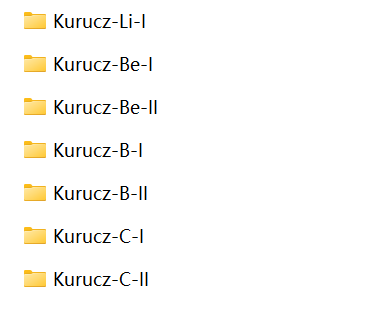
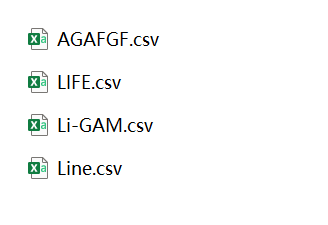

# Kurucz-Atoms — high ionization stages

Converts atomic line data from the [Kurucz atomic database](http://kurucz.harvard.edu/)
into the standardised ExoMol format, for ionization stages **III and above**.

Existing ExoMol/ExoAtom coverage of Kurucz data stops at singly ionized species.
This repository holds the pipeline that extends it: a single automated workflow that
discovers processable species, selects among the source's competing and
non-interchangeable transition products, converts them, and validates the result.

The delivered dataset covers **155 species across 35 elements at stages III–X**,
comprising 1,486,732 energy levels and 734,704,179 transitions.

## Data

The data are not in this repository — they are roughly 36 GB. They are archived on
Zenodo:

| Release | Coverage | DOI |
| --- | --- | --- |
| This work | Ionization stages III–X, 155 species | [10.5281/zenodo.21907103](https://doi.org/10.5281/zenodo.21907103) |
| Earlier work | Neutral and singly ionized | [10.5281/zenodo.12819622](https://doi.org/10.5281/zenodo.12819622) |

Each species occupies one directory named for its element and ionization stage,
holding three files under the ExoMol naming convention:

```
Kurucz-data/Ni-X/Ni_X__Kurucz.states
                 Ni_X__Kurucz.trans
                 Ni_X__Kurucz.pf
```

Anything downloaded or generated by the pipeline is excluded by `.gitignore`. The
point of the pipeline is that the dataset can be regenerated rather than only
downloaded: source files are fetched from Kurucz at run time and are not
redistributed here.

## Requirements

Python 3.10. Install with:

```bash
pip install -r requirements-validation.txt
```

`pyexocross` is pinned to 1.1.9, the version the validation was verified against.
The conversion itself needs only numpy and pandas; the rest are for validation.

## Converting

Process a single ion — element symbol plus charge, where `0=I`, `1=II`, `2=III`:

```bash
python3 process_kurucz_atom.py --element Ni --charge 9      # Ni X
```

Process a range of charge states for one element:

```bash
python3 process_kurucz_atom.py --element Fe --start-charge 2 --max-charge 9
```

Discover and process everything the database offers:

```bash
python3 process_kurucz_atom.py --all --max-charge 9 --keep-going
```

Survey what is available without downloading anything:

```bash
python3 process_kurucz_atom.py --all --list-only --manifest discovery.csv
```

Useful flags:

| Flag | Effect |
| --- | --- |
| `--states-only` | Rebuild the state file without touching transitions |
| `--validate` | Check local outputs and write CSV reports; no network access |
| `--overwrite` | Replace existing outputs rather than skipping them |
| `--keep-going` | Continue past a failing species instead of stopping |
| `--data-root` | Where raw, intermediate and final files are written |

Batch entry points used for the released dataset:

- `run_kurucz_only.py` — ions available only in Kurucz
- `run_kurucz_nist_overlap.py` — ions present in both Kurucz and NIST

## Validating

The validation package under `validation/` runs structural preflight checks on
`.states`/`.trans`/`.pf`, charge-aware metadata validation, and then drives
PyExoCross to recompute partition functions, radiative lifetimes and LTE stick
spectra from the delivered files alone.

```bash
python3 -m validation.run --ion Sc_III
python3 -m validation.run --all-ions --temperatures 1000 3000 6000
```

See [docs/PYEXOCROSS_VALIDATION.md](docs/PYEXOCROSS_VALIDATION.md) for schemas,
units, tolerances and interpretation, and
[docs/generic-high-ion-validation.md](docs/generic-high-ion-validation.md) for the
reusable entry point.

Unit tests, including a C III fixture and a CLI smoke test:

```bash
pytest tests/
```

## Analysis

Scripts producing the quantitative results reported in the accompanying
dissertation. Each is standalone and reads the delivered files.

| Script | What it establishes |
| --- | --- |
| `build_completeness_table.py` | Declared versus delivered transition counts per species |
| `check_a_equivalence.py` | Whether Einstein *A* derived from `.lines` reproduces published *A* |
| `sweep_guards.py` | Wavenumber consistency guard applied across the whole dataset |
| `compare_nist.py` | Comparison against NIST-derived ExoMol files |
| `run_overlap_batch.py` | Batch driver for the above over all overlap ions |
| `make_figures.py` | Figures aggregating across species |
| `sort_trans_by_wavenumber.py` | Orders `.trans` by ascending wavenumber |
| `generate_ti_ii_issue_report.py` | Evidence report for the Ti II row-misalignment defect |

`gfelem_references.xlsx` holds the source database's own bibliography, mapping each
species to the works its calculations draw on.

## Legacy scripts

The per-ion scripts from the earlier neutral / singly ionized project are retained
because parts of the dataset were originally produced with them, and because
`States_Process.py`, `Trans_Process.py` and `PF_Process.py` carry fixes made here:
`CreateFolder.py`, `FileLineCount.py`, `GrabKuruczAtomic.py`, `PF_Plot.py`,
`Spectra Process.py`, `States_Merge.py`, `Trans_Merge.py`, `Trans_Remove.py`.

They expect scraped files arranged one folder per ion, named
`Kurucz-Atom_name-I(II)`, containing the `gam`, `lines`, `agafgf` and lifetime files
retrieved by `GrabKuruczAtomic.py`:




`process_kurucz_atom.py` supersedes this flow — it performs discovery, retrieval and
conversion in one step and does not require the layout to be prepared by hand.

## Provenance

This repository continues work begun at
<https://github.com/Melo-Melon/Kurucz-Atoms>, which covers neutral and singly
ionized species. The extension to ionization stages III and above — the automated
pipeline, the validation package, the integrity guards and the analysis scripts —
is the contribution here.

Users of the data should cite the Kurucz database in addition to the Zenodo record:
the physics is the source's, and what this project contributes is its conversion,
validation and documentation.
